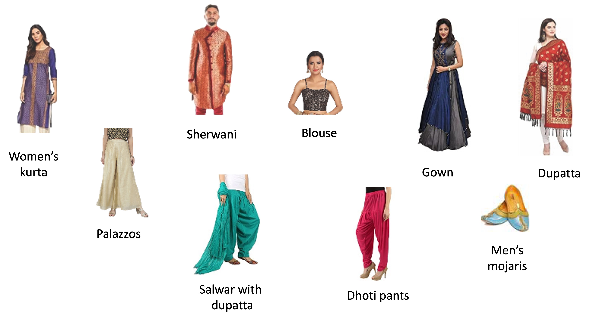
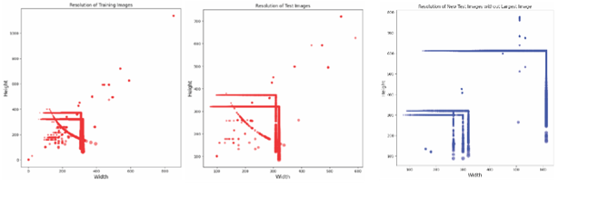
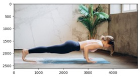
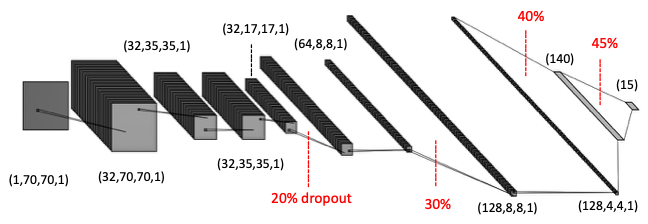
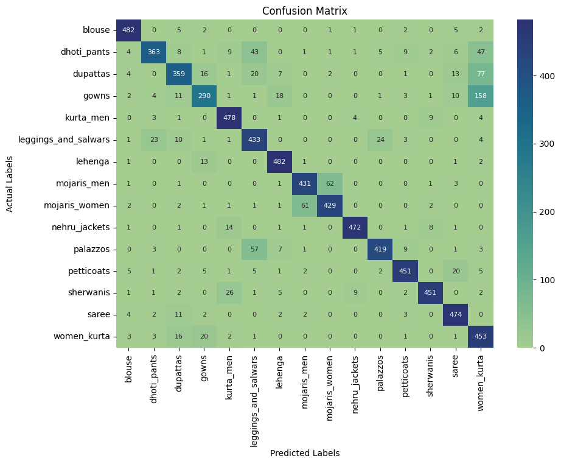
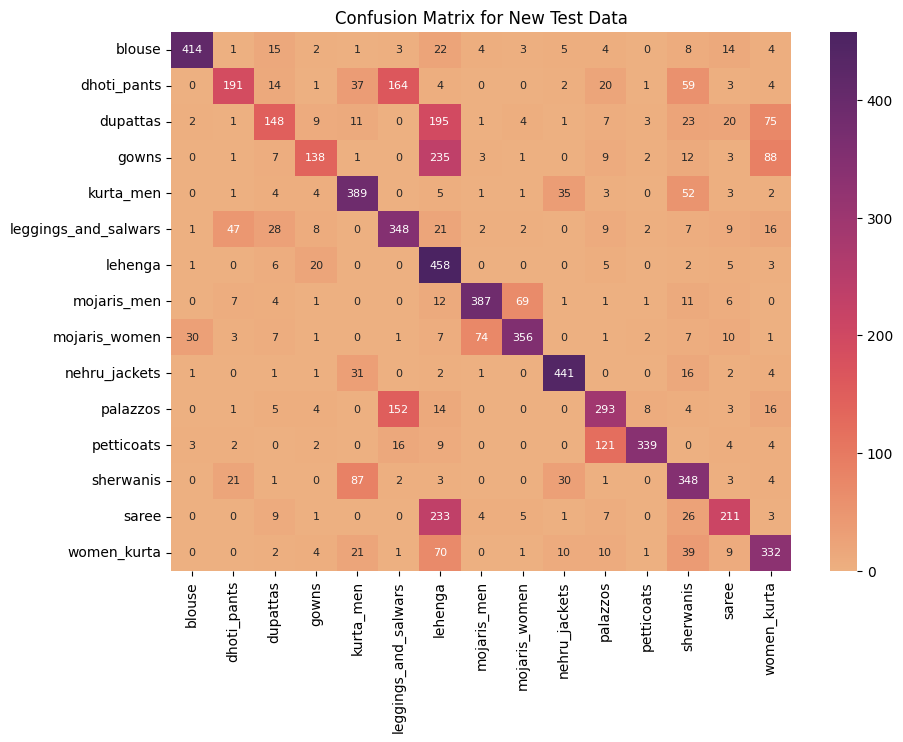
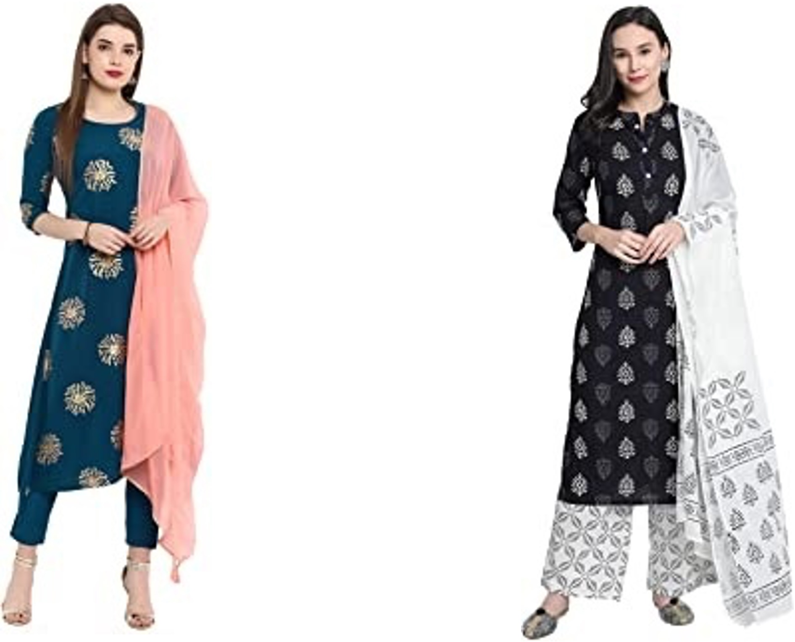
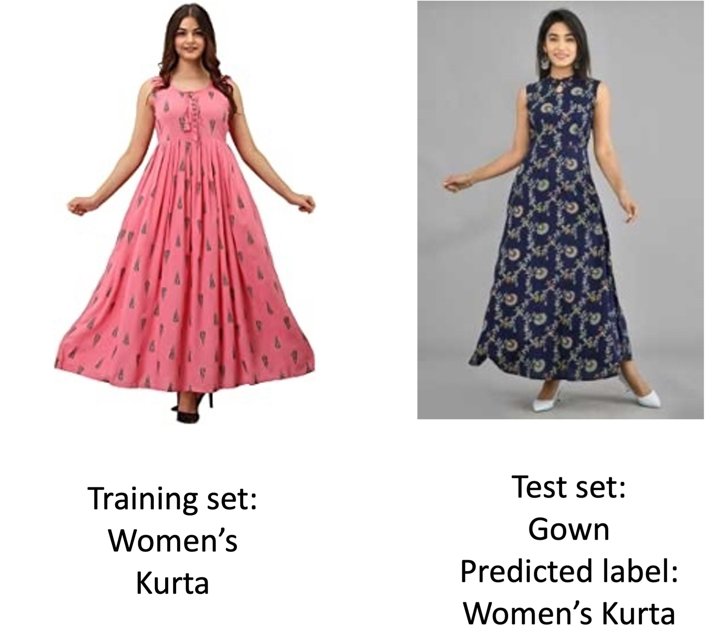
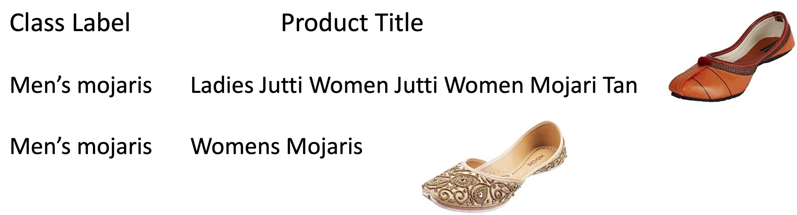

 Classification of Traditional Indian Clothing Images
==============================

  

## 1. Business Problem
A new e-commerce site in the U.S. wants highly accurate model to classify images of traditional Indian clothing since many of these clothes are quite similar.

## 2. Data
The model was trained on data from the Indo Fashion dataset on [Kaggle](https://www.kaggle.com/datasets/validmodel/indo-fashion-dataset). This dataset has 91166 training images, 7500 validation images, 7500 test images, and 15 different labels: 

Women’s Kurtas. Sarees, Blouses, Leggings and Salwars, Men’s Kurtas, Dupattas, Nehru jackets, Lehenga, Gowns, Petticoats, Dhoti Pants, Palazzos, Women’s Mojaris, Sherwanis, Men’s Mojaris

New test images were scraped using Beautiful Soup from the following sites:
 

  

## 3. Exploratory Data Analysis
Plots of the sizes of images in the training set and each test set are shown below. The images varied greatly in size; however, the new test set's average image size is larger than the training set or the original test set. One image is not plotted in the new test set because it is very large.

  

Biggest image in the new test set:

  

## 4. Modeling
Three convolutional neural network architectures were used:
### ResNet50 
- Without top layer 
- With fully connected layer of 100 nodes and relu activation
- 20% Dropout
- Output layer with softmax activation

### ResNet152-v2
- Without top layer 
- With fully connected layer of 512 nodes and relu activation
- 40% Dropout
- Output layer with softmax activation

### Model 1:

  

- Batch normalization after each convolutional layer
- Softmax activation for output layer and relu activation for the other layers

## 5. Metrics

| Original Test Set   | Accuracy | Precision | Recall | F1-score|
|------|-------|-------|-----|----|
| Model 1 | 86.23 % | 85.98 % | 84.68 % | 84.61 % |
| ResNet50 | 85.05 % | 85.91 % | 85.05 % | 85.10 % | 
| ResNet152-v2 | 80.92 % | 82.34 % | 80.93 % | 80.83 % | 

| New Test Set   | Accuracy |
|------|-------|
| Model 1 | 63.91 % | 
| ResNet50 | 63.22 % |  
| ResNet152-v2 | 61.82 % | 

The ResNet50 and Model 1 both outperformed the ResNet152-v2. Since accuracy is the essential metric for this project, I used the confusion matrices for Model 1.

### Confusion Matrices for Model 1

  
  

**Training and test images that look similar but are labeled differently**

  

The women above are wearing both kurtas and dupattas.

  

**Mis-labeled Training Images**

  

## 6. Business Insights
- Since the accuracy with newly acquired data was 63.91% significantly lower than the 86.23% for the original test set, a new model needs to be trained on current images from other e-commerce sites.
 
- It is imperative that the data used in training a new model be correctly categorized. The product title may be a better way of determining the category than the label used in searching for the image.
 
- Many clothes are shown in conjunction with one another. A multi-class multi-label model may be a better approach.
